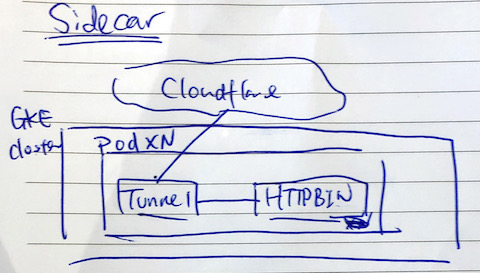
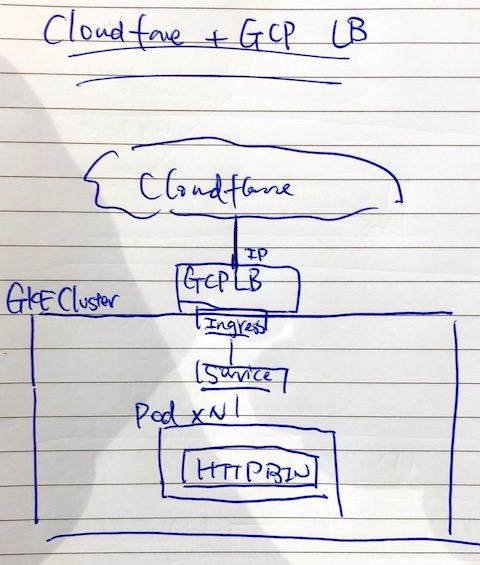
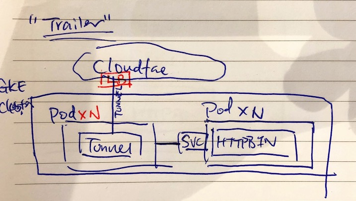

# Cloudflare x GKE - Proof of Concepts

Some proof-of-concepts that demonstrate how Cloudflare can work with GKE.

## Getting started

### Step 0: Prerequisites: 
* Google Cloud account
* [Google Cloud SDK with `gcloud` & `kubectl` CLI tools]((https://www.terraform.io/downloads.html))
* [Terraform with `terraform` CLI tools](https://www.terraform.io/downloads.html)
* Cloudflare account with Argo enabled

### Step 1: Bootstrap the GKE environment with Terraform

1.1 Initialize Terraform
```terraform init```

1.2 Plan Terraform and verify the plan
```terraform plan```

(Optional) Set the variables as environment variables if you want want to entering them interactively every time you plan.
For example,
```
# Read from the local user name
export TF_VAR_resource_prefix=$USER
# Read from gcloud default project id
export TF_VAR_gcp_project_id=$(gcloud config get-value project)
```

1.3 Apply the Terraform plan

```
terraform apply
```
It will takes  > 10 minutes. 

### Step 2: Deploy your workloads to to the GKE environment with `kubectl`

2.1 Connect to the cluster
Follow the instructions in GCP Console -> Kubernetes Engine ->  Cluster -> Connect
OR run 

```
gcloud container clusters get-credentials <CLUSTER_NAME>
``` 

2.2 Run some kubectl to make sure it's configured correctly.
```kubectl config get-contexts```

2.3 The foundation has been laid. The real fun starts from here...

## Deployment Mode 1: Cloudflare Argo Tunnel in Sidecar Model with Cloudflare Load Balancer
`cloudflared-sidecar.yaml`

### Architecture



### Integration with Cloudflare

1. Login in to Cloudflare Argo Tunnel 

```cloudflared tunnel login```

2. Load the cert to the K8s secret store

```kubectl create secret generic cloudflared-cert --from-file="$HOME/.cloudflared/cert.pem"```

3. Apply the deployment

```kubectl apply  -f cloudflared-sidecar.yaml```

4. Check Cloudflare dashboard > Traffic > Argo Tunnel

### References
* [Argo Tunnel K8S Sidecar Guide](https://developers.cloudflare.com/argo-tunnel/reference/sidecar/)


#### OOMKill Exit Code 137 
Solution: remove resource limit
[My Container is terminated](https://kubernetes.io/docs/concepts/configuration/manage-compute-resources-container/#my-container-is-terminated)


## Deployment Mode 2: Cloudflare with GKE Ingress with GKE External Load Balancer
 `gke-ingress.yaml`

### Architecture: 



### Integration with Cloudflare

1. Apply the deployment 

```kubectl apply -f gke-ingress.yaml```

2. Get the external IP address 

```kubectl get ingress```

3. Add it to Cloudflare DNS as an origin 

### References
* [Using Kubernetes on GKE and AWS with Cloudflare Load Balancer](https://support.cloudflare.com/hc/en-us/articles/115003384591-Using-Kubernetes-on-GKE-and-AWS-with-Cloudflare-Load-Balancer)
* [Setting up HTTP Load Balancing with Ingress](https://cloud.google.com/kubernetes-engine/docs/tutorials/http-balancer)
* [HTTP(S) load balancing with Ingress](https://cloud.google.com/kubernetes-engine/docs/concepts/ingress)
* [Configuring load balancing through Ingress](https://cloud.google.com/kubernetes-engine/docs/how-to/load-balance-ingress)
* [GKE Exposing applications using services - ClusterIP vs NodePOrt vs LoadBalancer etc](https://cloud.google.com/kubernetes-engine/docs/how-to/exposing-apps)
* [ClusterIP vs NodePOrt vs LoadBalancer etc](https://medium.com/google-cloud/kubernetes-nodeport-vs-loadbalancer-vs-ingress-when-should-i-use-what-922f010849e0)
* [Making Load Balancer IP Static](https://cloud.google.com/kubernetes-engine/docs/concepts/ingress#static_ip_addresses_for_https_load_balancers)


### Error 400 when creating ingress
`Error during sync: error running load balancer syncing routine: loadbalancer default-cwang-httpbin-ingress--6029373544ea4799 does not exist: googleapi: Error 400: STANDARD network tier (the project's default network tier) is not supported: STANDARD network tier is not supported for global forwarding rule., badRequest`

Just set the Network Service Tier to Premium. 
[Using Network Service Tiers](https://cloud.google.com/network-tiers/docs/using-network-service-tiers)


## Deployment Mode 3: Cloudflare Argo Tunnel in "Trailer" mode without Cloudflare Load Balancer or GCP Forwarding Rule
`cloudflared-trailer.yaml`

### Architecture: 


### Integration with Cloudflare

1. Login in to Cloudflare Argo Tunnel 

```cloudflared tunnel login```

2. Load the cert to the K8s secret store

```kubectl create secret generic cloudflared-cert --from-file="$HOME/.cloudflared/cert.pem"```

3. Apply the deployment

```kubectl apply -f cloudflared-trailer.yaml```

3. Check Cloudflare dashboard > Traffic > Argo Tunnel

### Error - cloudflared listening to service

``` time="2019-12-05T06:18:49Z" level=error msg="unable to connect to the origin" error="Get http://10.112.9.183:80: dial tcp 10.112.9.183:80: connect: connection refused"
```

The service is not working. 
```
kubectl run -it --rm --restart=Never alpine --image=alpine sh

If you don't see a command prompt, try pressing enter.
/ # wget -O- cwang-gke-int-lb-service
Connecting to cwang-gke-int-lb-service (10.112.9.183:80)
wget: can't connect to remote host (10.112.9.183): Connection refused
```

Service is not associated with the correct deployment?
```
kubectl describe  endpoints cwang-gke-int-lb-service
Name:         cwang-gke-int-lb-service
Namespace:    default
Labels:       app=cwang-gke-int-lb-app
Annotations:  <none>
Subsets:
Events:  <none>
```

## References

### Misc
* [My unofficial `cloudflared` build](https://hub.docker.com/r/mw866/cloudflared)
* [Merging an upstream repository into your fork](https://help.github.com/en/github/collaborating-with-issues-and-pull-requests/merging-an-upstream-repository-into-your-fork)


### Google Cloud

* [gcloud auth application-default login](https://cloud.google.com/sdk/gcloud/reference/auth/application-default/login)

### GKE and Kubernetes

* [Labels & Selectors](https://kubernetes.io/docs/concepts/overview/working-with-objects/labels/)
* [GKE Network Overview](https://cloud.google.com/kubernetes-engine/docs/concepts/network-overview)
* [Using environment variables inside of your config](https://kubernetes.io/docs/tasks/inject-data-application/efine-environment-variable-container/#using-environment-variables-inside-of-your-config)
* [DNS for Services and Pods](https://kubernetes.io/docs/concepts/services-networking/dns-pod-service/)
* [Labels, Selectors, and MatchingLabels](https://medium.com/@zwhitchcox/matchlabels-labels-and-selectors-explained-in-detail-for-beginners-d421bdd05362)


### Terraform 

* [Official Terraform docs on `google_container_cluster`](https://www.terraform.io/docs/providers/google/r/container_cluster.html)
* [Learn Terraform (with GCP)](https://learn.hashicorp.com/terraform/gcp/intro)
* [Modules Overview](https://learn.hashicorp.com/terraform/modules/modules-overview)

### `kubectl` Cheatsheet 
```
kubectl config current-context 
kubectl create -f FILE.yaml
kubectl apply -f FILE.yaml
kubectl delete -f FILE.yaml
kubectl get namespace
kubectl config get-contexts  
kubectl get po --output wide
kubectl describe pods
kubectl logs POD_NAME CONTAINER_NAME
kubectl top node
kubectl get ingress INGRESS_NAME --output yaml
kubectl exec POD_NAME   -- printenv | grep SERVICE   
kubectl exec -it POD_NAME -- /bin/bash
kubectl run -it --rm --restart=Never alpine --image=alpine sh
kubectl get endpoints
kubectl scale deploy tunnel --replicas=2

```

### `terraform` Cheatsheet
```
terraform show gke.tf
```
